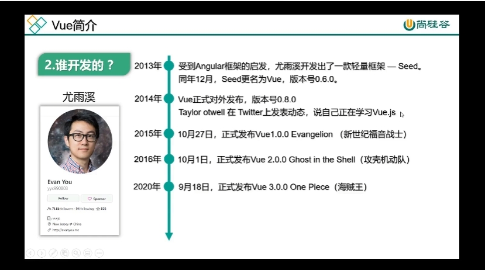

# Vue 簡介

Vue 是一套構建用戶介面的漸進式 Javascript 框架。

- 構建用戶介面: Vue 的核心專注於構建用戶介面 (UI)。
- 漸進式框架: 根據需求，可逐層擴展應用 (Vue 插件)。

### Vue 歷史

### Vue 特點

1. 組件化開發: 提高代碼復用率，提高代碼維護性。
2. 聲明式設計: 不再需直接操作 DOM，提高開發效率。
3. 虛擬 DOM + diff 算法: 避免了大量非必要渲染，提高效率。

### Js 必修課

- ES6 語法
- ES6 模組化
- package manager
- 原型 & 原型鏈
- 陣列處裡
- 網路編程
- 非同步編程